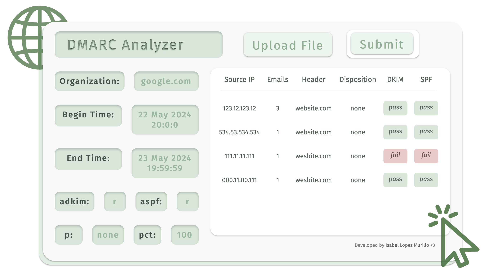
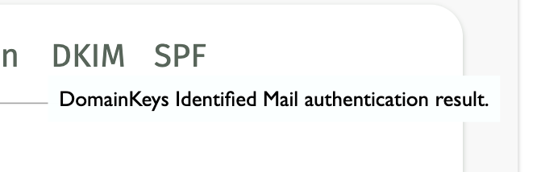

# DMARC Analyzer

https://analopezmurillo.github.io/DMARC-Analyzer/

Provides an analyzer to parse aggregate DMARC XML reports in a user-friendly manner. Uses Javascript to extract information from aggregate report and returns an overview of the report in tabular format. 

To use, please navigate to [this link](https://analopezmurillo.github.io/DMARC-Analyzer/) and upload a valid XML file by clicking "Upload File" and "Submit". Information will then be displayed according to the aggregate report. 

Flavor text explaining each acroynm is also included:

For user security, this website runs on memory only and does not store user or XML information. Please note that because of this, analysis data will be lost on page refresh.
